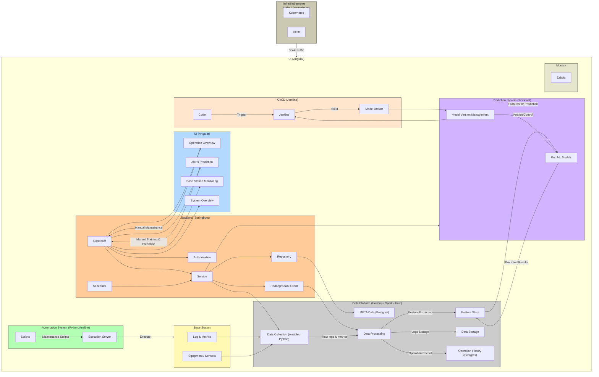

# Robotic-Process-Automation

```mermaid
flowchart TB
    %% === Robotic Process Automation System ===
    subgraph ROBOTIC_SYSTEM["UI (Angular)"]
    %% class definitions
    classDef bigFont font-size:16px;

    %% === UI ===
    subgraph UI["UI (Angular)"]
        style UI fill:#b3d9ff,stroke:#333,stroke-width:1px
        OPERATION_UI["Operation Overview"]
        PREDICTION_UI["Alerts Prediction"]
        BS_MONITOR_UI["Base Station Monitoring"]
        SYS_MONITOR_UI["System Overview"]
    end
    class OPERATION_UI,PREDICTION_UI,BS_MONITOR_UI,SYS_MONITOR_UI bigFont;

    %% === Backend ===
    subgraph BACKEND["Backend (Springboot)"]
        style BACKEND fill:#ffcc99,stroke:#333,stroke-width:1px
        API["Controller"]
        SERVICE["Service"]
        REPO["Repository"]
        AUTH["Authorization"]
        CLIENT["Hadoop/Spark Client"]
        SCHED["Scheduler"]
    end
    class API,SERVICE,REPO,AUTH,CLIENT,SCHED bigFont;

    API --> AUTH
    API --> SERVICE
    SCHED --> SERVICE

    %% === Automation ===
    subgraph AUTOMATION["Automation System (Python/Ansible)"]
        style AUTOMATION fill:#b3ffb3,stroke:#333,stroke-width:1px
        JOB_SERVER["Execution Server"]
        SCRIPT_OPS["Scripts"]
    end
    class JOB_SERVER,SCRIPT_OPS bigFont;

    %% === Prediction ===
    subgraph PREDICTION["Prediction System (XGBoost)"]
        style PREDICTION fill:#d1b3ff,stroke:#333,stroke-width:1px
        MODEL_EXEC["Run ML Models"]
        MODEL_MGMT["Model Version Management"]
    end
    class MODEL_EXEC,MODEL_MGMT bigFont;

    %% === Data Platform ===
    subgraph DATA_PLATFORM["Data Platform (Hadoop / Spark / Hive)"]
        style DATA_PLATFORM fill:#cccccc,stroke:#333,stroke-width:1px
        DATA_COLLECT["Data Collection (Ansible / Python)"]
        DATA_PROC["Data Processing"]
        FEATURE_STORE["Feature Store"]
        DATA_STORAGE["Data Storage"]
        META_DB["META Data (Postgres)"]
        OPERATION_HISTORY["Operation History (Postgres)"]
    end
    class DATA_COLLECT,DATA_PROC,FEATURE_STORE,DATA_STORAGE,META_DB,OPERATION_HISTORY bigFont;

    %% === Base Station ===
    subgraph BASE_STATION["Base Station"]
        style BASE_STATION fill:#fff9b3,stroke:#333,stroke-width:1px
        LOG_METRICS["Log & Metrics"]
        DEVICE["Equipment / Sensors"]
    end
    class LOG_METRICS,DEVICE bigFont;

    %% === CI/CD ===
    subgraph CICD["CI/CD (Jenkins)"]
        style CICD fill:#ffe6cc,stroke:#333,stroke-width:1px
        CODE["Code"]
        JENKINS["Jenkins"]
        ML_ART["Model Artifact"]
    end
    class CODE,JENKINS,ML_ART bigFont;

    CODE -->|Trigger| JENKINS
    MODEL_MGMT --> JENKINS
    JENKINS -->|Build| ML_ART
    ML_ART --> MODEL_MGMT

    %% === System Monitor ===
    subgraph SYS_MONITOR["Monitor"]
        style SYS_MONITOR fill:#e6e6cc,stroke:#333,stroke-width:1px
        ZABBIX["Zabbix"]
    end
    class ZABBIX bigFont;

    %% === Execution Flow ===
    API --> OPERATION_UI
    OPERATION_UI -->|Manual Maintenance| API
    API --> PREDICTION_UI
    API --> BS_MONITOR_UI
    API --> SYS_MONITOR_UI
    PREDICTION_UI -->|Manual Training & Prediction| API
    SERVICE --> DATA_COLLECT
    SERVICE --> PREDICTION
    SERVICE --> REPO --> META_DB
    SERVICE --> CLIENT --> DATA_PROC

    %% === Monitoring Triggers ===
    DATA_COLLECT -->|Raw logs & metrics| DATA_PROC
    DATA_PROC -->|Feature Extraction| FEATURE_STORE
    DATA_PROC -->|Logs Storage| DATA_STORAGE
    DATA_PROC -->|Operation Record| OPERATION_HISTORY
    FEATURE_STORE -->|Features for Prediction| MODEL_EXEC
    MODEL_EXEC -->|Predicted Results| FEATURE_STORE
    SCRIPT_OPS -->|Maintenance Scripts| JOB_SERVER
    JOB_SERVER -->|Execute| BASE_STATION
    MODEL_MGMT -->|Version Control| MODEL_EXEC

    %% === Optional Paths ===
    LOG_METRICS --> DATA_COLLECT
    DEVICE --> DATA_COLLECT

    end
    %% === Infra ===
    subgraph INFRA["Infra(Kubernetes
Helm / Prometheus)"]
        style INFRA fill:#ccc9b3,stroke:#333,stroke-width:1px
        KUBE["Kubernetes"]
        HELM["Helm"]
    end

    INFRA --> |Scale out/in| ROBOTIC_SYSTEM
```